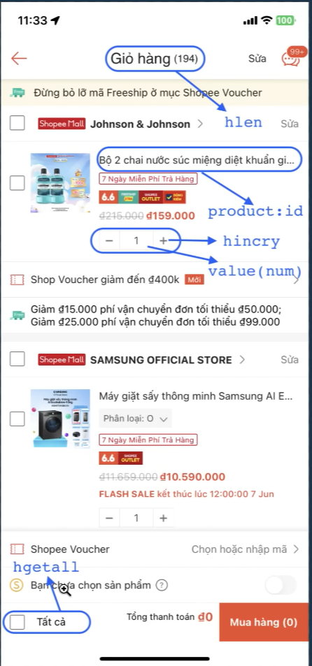

section 29
string redis
string redis-cli
---
# Redis
redis kieu du lieu string bao gom cac cach luu data nhu sau: embstring luu data <= 44bytes >,raw >44 bytes ,int luu so; sử dụng string redis làm 1 đối tượng cache trong db. vi du khi trien khai 3 server cho web, user login o 1 server, thanh cong, server se luu thong tin user vao redis, khi user request o server khac, server do se lay thong tin user tu redis de xac thuc ma khong can phai login lai
# Cac lenh thao tac voi string redis
set key value 
get key
del key
exists key
incr key //tang gia tri value cua key len 1
decr key //giam gia tri value cua key xuong 1
incrby key 10 //tang gia tri key len 10
decrby key 10 //giam gia tri key xuong 10
mset key1 value1 key2 value2
mget key1 key2
keys 'n*' //tim tat ca key bat dau bang n
expire key 60 //dat thoi gian song cho key la 60s
ttl key //xem thoi gian con lai cua key
type key //xem kieu du lieu cua key
set key value ex 60 //dat ten key,value,thoi gian song cho key la 60s
setnx key value //chi dat key neu key chua ton tai

redis hash, su dung hash o anh duoi
hset key field value //tao hash
hget key field //lay value cua field trong hash
hdel key field //xoa field trong hash
hmset key field1 value1 field2 value2 //tao hash voi nhieu field
hmget key field1 field2 //lay value cua nhieu field trong hash
hgetall key //lay tat ca field va value trong hash
hlen key //dem so field trong hash
hexists key field //kiem tra field co ton tai trong hash khong
hincrby key field 10 //tang gia tri cua field len 10
hkeys key //lay tat ca field trong hash
hvals key //lay tat ca value trong hash

redis list, su dung lam hang doi tin nhan
lpush key value1 value2 //them value vao ben trai list
rpush key value1 value2 //them value vao ben phai list
lrange key start stop //lay tat ca phan tu trong list (start va stop la chi so cua phan tu trong list, bat dau tu 0, ket thuc la -1)
lpop key //lay va xoa 1 phan tu ben trai list
rpop key //lay va xoa 1 phan tu ben phai list
lpop key count //lay va xoa count phan tu ben trai list
rpop key count //lay va xoa count phan tu ben phai list
lindex key index //lay phan tu tai chi so index trong list
llen key //dem so phan tu trong list
lrem key count value //xoa count phan tu co gia tri value trong list
ltrim key start stop //cat list tu chi so start den chi so stop
exists key //kiem tra list co ton tai khong
lset key index value //cap nhat phan tu tai chi so index trong list
linsert key before|after pivot value //chen value vao truoc hoac sau phan tu co gia tri pivot trong list

redis set, su dung de luu tru cac gia tri khong trung lap, phat trien tinh nang like, ban chung nhu facebook
sadd key member1 member2 //them member vao set
srem key member1 member2 //xoa member khoi set
smembers key //lay tat ca member trong set
scard key //dem so member trong set
sismember key member //kiem tra member co ton tai trong set khong
srandmember key count //lay ngau nhien count member trong set
spop key count //lay va xoa ngau nhien count member trong set
smove source destination member //chuyen member tu set source sang set destination
sinter key1 key2 //lay giao cua 2 set
sdiff key1 key2 //lay nhung member khong co trong set key2