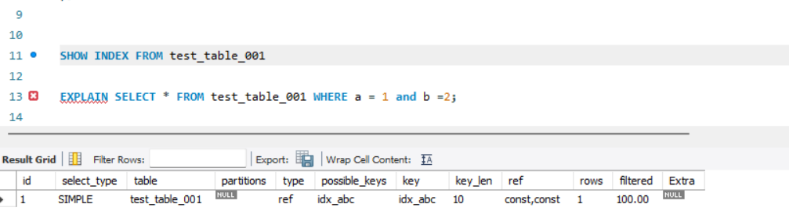
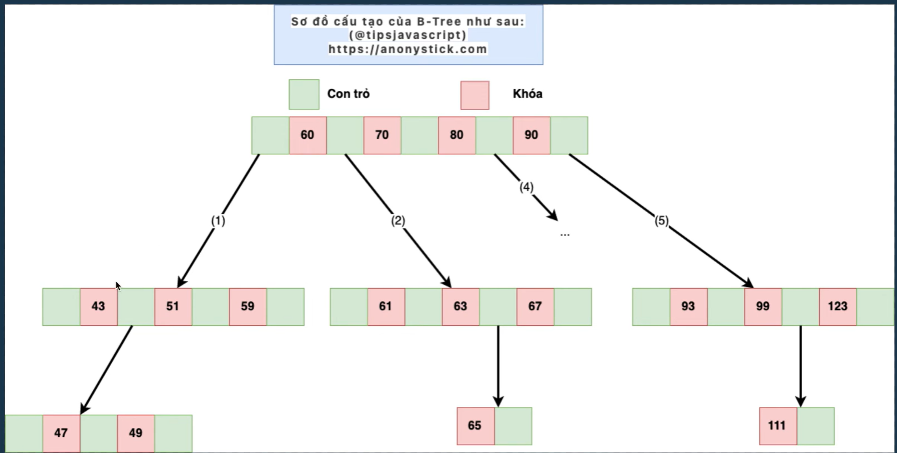
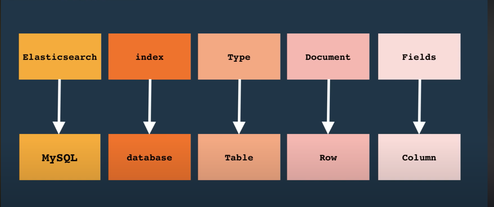

section 29
string redis
string redis-cli
---
# Redis
redis kieu du lieu string bao gom cac cach luu data nhu sau: embstring luu data <= 44bytes >,raw >44 bytes ,int luu so; sử dụng string redis làm 1 đối tượng cache trong db. vi du khi trien khai 3 server cho web, user login o 1 server, thanh cong, server se luu thong tin user vao redis, khi user request o server khac, server do se lay thong tin user tu redis de xac thuc ma khong can phai login lai
# Cac lenh thao tac voi string redis
set key value 
get key
del key
exists key
incr key //tang gia tri value cua key len 1
decr key //giam gia tri value cua key xuong 1
incrby key 10 //tang gia tri key len 10
decrby key 10 //giam gia tri key xuong 10
mset key1 value1 key2 value2
mget key1 key2
keys 'n*' //tim tat ca key bat dau bang n
expire key 60 //dat thoi gian song cho key la 60s
ttl key //xem thoi gian con lai cua key
type key //xem kieu du lieu cua key
set key value ex 60 //dat ten key,value,thoi gian song cho key la 60s
setnx key value //chi dat key neu key chua ton tai

redis hash, su dung hash o anh duoi
hset key field value //tao hash
hget key field //lay value cua field trong hash
hdel key field //xoa field trong hash
hmset key field1 value1 field2 value2 //tao hash voi nhieu field
hmget key field1 field2 //lay value cua nhieu field trong hash
hgetall key //lay tat ca field va value trong hash
hlen key //dem so field trong hash
hexists key field //kiem tra field co ton tai trong hash khong
hincrby key field 10 //tang gia tri cua field len 10
hkeys key //lay tat ca field trong hash
hvals key //lay tat ca value trong hash


redis list, su dung lam hang doi tin nhan
lpush key value1 value2 //them value vao ben trai list
rpush key value1 value2 //them value vao ben phai list
lrange key start stop //lay tat ca phan tu trong list (start va stop la chi so cua phan tu trong list, bat dau tu 0, ket thuc la -1)
lpop key //lay va xoa 1 phan tu ben trai list
rpop key //lay va xoa 1 phan tu ben phai list
lpop key count //lay va xoa count phan tu ben trai list
rpop key count //lay va xoa count phan tu ben phai list
lindex key index //lay phan tu tai chi so index trong list
llen key //dem so phan tu trong list
lrem key count value //xoa count phan tu co gia tri value trong list
ltrim key start stop //cat list tu chi so start den chi so stop
exists key //kiem tra list co ton tai khong
lset key index value //cap nhat phan tu tai chi so index trong list
linsert key before|after pivot value //chen value vao truoc hoac sau phan tu co gia tri pivot trong list

redis set, su dung de luu tru cac gia tri khong trung lap, phat trien tinh nang like, ban chung nhu facebook
sadd key member1 member2 //them member vao set
srem key member1 member2 //xoa member khoi set
smembers key //lay tat ca member trong set
scard key //dem so member trong set
sismember key member //kiem tra member co ton tai trong set khong
srandmember key count //lay ngau nhien count member trong set
spop key count //lay va xoa ngau nhien count member trong set
smove source destination member //chuyen member tu set source sang set destination
sinter key1 key2 //lay giao cua 2 set
sdiff key1 key2 //lay nhung member khong co trong set key2

redis sorted set, xep hang san pham
zadd key score1 member1 score2 member2 //them member vao sorted set voi diem so tuong ung
zrem key member1 member2 //xoa member khoi sorted set
zrange key start stop //lay tat ca member trong sorted set theo thu tu tang dan cua diem so (start va stop la chi so cua member trong sorted set, bat dau tu 0, ket thuc la -1)
zrevrange key start stop //lay tat ca member trong sorted set theo thu tu giam dan cua diem so (start va stop la chi so cua member trong sorted set, bat dau tu 0, ket thuc la -1)
zcard key //dem so member trong sorted set
zincrby key increment member //tang diem so cua member len increment
zrangebyscore key min max //lay tat ca member trong sorted set co diem so trong khoang tu min den max
zscore key member //lay diem so cua member trong sorted set

transaction redis
multi //bat dau giao dich
exec //ket thuc giao dich
discard //huy giao dich
watch key1 key2 //theo doi thay doi cua key1,key2 neu co thay doi thi giao dich se bi huy

# vi du
neu trong transaction co loi cu phap thi khi exec xong toan bo giao dich se bi huy
neu trong transaction co 1 key bi thay doi boi ben ngoai thi khi exec xong toan bo giao dich se bi huy
neu trong transaction ko co loi cu phap nhung co loi logic thi khi exec xong toan bo giao dich van duoc thuc hien, dong nao loi thi se bi loi.


### mysql index
create index idx_name on table_name(column_name(length)) [asc|desc];
alter table table_name add index idx_name(column_name(length)) [asc|desc];
alter table table_name drop index idx_name;


1.normal index: index binh thuong, ko co bat ki rang buoc nao, muc dich la cai thien hieu suat truy van
create index idx_name on table_name(column_name(length)) [asc|desc];
example: create index idx_name on users(name(10)) asc;
2.unique index: index duy nhat, ko cho phep gia tri trung lap, hay dung cho email hoac cccd
create unique index idx_name on table_name(column_name(length)) [asc|desc];
example: create unique index idx_name on users(email(20)) desc;
3.fulltext index: index toan van, chi su dung cho cac truong kieu text, varchar, char
create fulltext index idx_name on table_name(column_name);
example: create fulltext index idx_name on posts(content);
4.primary index: index chinh, moi bang chi co 1 primary index, ko cho phep gia tri null, gia tri phai duy nhat
Primary key(id) //id la primary key
5.composite index: index hop, index tren nhieu cot
create index idx_name on table_name(column1(length), column2(length)) [asc|desc];
example: create index idx_name on users(name(10), email(20)) asc;

### vi du ve composite index
1. Nguyên tắc Leftmost Prefix

Với composite index (a, b, c) → chỉ dùng index hiệu quả nếu bắt đầu từ cột ngoài cùng bên trái và liên tục.
Các tình huống dùng được:
WHERE a = ?
WHERE a = ? AND b = ?
WHERE a = ? AND b = ? AND c = ?
Không dùng được nếu bỏ a:
WHERE b = ? (trừ khi có index riêng cho b).

📌 2. Điều kiện WHERE
So sánh bằng (=, IN, BETWEEN) → tận dụng index tốt.
So sánh dạng range (<, >, BETWEEN, LIKE 'abc%') → dùng index nhưng chỉ đến cột đó, cột sau bỏ.
Ví dụ index (a, b, c):
WHERE a = 1 AND b > 10 AND c = 5
→ chỉ dùng đến (a, b), bỏ c.

📌 3. ORDER BY và GROUP BY
Có thể tránh filesort nếu ORDER BY / GROUP BY khớp với index theo leftmost prefix.
Ví dụ index (a, b, c):
ORDER BY a, b ✅ dùng index.
ORDER BY b ❌ phải filesort.
Nếu WHERE phá vỡ prefix → ORDER BY sau đó cũng không cứu được.

📌 4. Covering Index
Nếu tất cả cột trong SELECT đều nằm trong index → MySQL chỉ đọc index (không phải quay về bảng).
Giảm I/O nhưng không thay đổi quy tắc leftmost prefix.
Ví dụ index (a, b, c):
SELECT a, b FROM t WHERE b = 10; 
→ Dùng index full scan (covering), nhưng không theo prefix chuẩn.

📌 5. JOIN
Khi JOIN trên cột có index → MySQL có thể dùng index để lookup (type: ref, eq_ref).
Ví dụ:
SELECT * FROM orders o
JOIN customers c ON o.customer_id = c.id;
→ Nếu customers.id là PK (có index) thì JOIN nhanh.

📌 6. LIMIT + ORDER BY
Nếu ORDER BY theo index → MySQL chỉ cần đọc một đoạn nhỏ trong index rồi dừng (limit pushdown).
Giúp query rất nhanh với LIMIT 10.

📌 7. Khi MySQL bỏ index
Bảng nhỏ (vài trăm dòng), MySQL chọn Full Table Scan vì rẻ hơn.
Điều kiện WHERE quá rộng, trả về hầu hết dữ liệu (index không còn ích gì).
Dùng hàm trên cột (WHERE YEAR(date) = 2024) → MySQL không tận dụng index (trừ khi có functional index).
So sánh không khớp kiểu dữ liệu (ví dụ cột số mà so với string).
👉 Nếu bạn bỏ qua a, MySQL không biết nhảy vào nhánh nào của cây, nên buộc phải bỏ index và quét toàn bảng.
CREATE TABLE test_table_001 (
    id INT PRIMARY KEY,
    a INT,
    b INT,
    c INT,
    d INT,
    INDEX idx_abc (a, b, c) -- Composite index on columns a, b, and c
);

danh composite index theo cong thuc sau:
cot nao ma co nhieu du lieu trung lap thi dat o cot cuoi cung
cot nao ma co it du lieu trung lap thi dat o cot dau tien.
cach nhan biet la lay count(distinct column_name) / count(*) neu ket qua < 0.1 thi dat o cot cuoi cung, neu > 0.1 thi dat o cot dau tien. cot nao lon hon thi dat truoc, cot nao nho hon thi dat sau
Nếu a và b có trong điều kiện WHERE thì MySQL sẽ dùng index (a, b) hiệu quả, không cần c
SHOW INDEX FROM test_table_001
🛠 Demo
-- Tạo bảng users
CREATE TABLE users (
    id INT AUTO_INCREMENT PRIMARY KEY,
    email VARCHAR(255)
);

-- Tạo UNIQUE INDEX dựa trên 20 ký tự đầu tiên
CREATE UNIQUE INDEX idx_email_prefix ON users(email(20));

-- Nếu muốn so sánh, có thể thêm UNIQUE INDEX full (comment để tránh xung đột)
-- CREATE UNIQUE INDEX idx_email_full ON users(email);

🧪 Test dữ liệu
-- Insert 2 email giống nhau ở 20 ký tự đầu
INSERT INTO users (email) VALUES ('abcdefghijabcdefghijZZZ@example.com');
INSERT INTO users (email) VALUES ('abcdefghijabcdefghijYYY@example.com');


👉 Kết quả:

Với UNIQUE INDEX email(20) → LỖI Duplicate entry, vì MySQL chỉ nhìn 20 ký tự đầu (abcdefghijabcdefghij).

Với UNIQUE INDEX email (full) → KHÔNG lỗi, vì 2 email khác nhau sau ký tự thứ 20.

🧪 Thêm 1 email khác hẳn
INSERT INTO users (email) VALUES ('differentemail@example.com');


👉 Chèn thành công với cả 2 loại index, vì prefix khác ngay từ đầu.

🎯 Kết luận

UNIQUE INDEX email(20) → tiết kiệm dung lượng nhưng có rủi ro duplicate “ảo”.

UNIQUE INDEX email (full) → chính xác tuyệt đối nhưng tốn bộ nhớ hơn.
EXPLAIN SELECT * FROM test_table_001 WHERE a = 1; --OK su dung index idx_abc
EXPLAIN SELECT * FROM test_table_001 WHERE a = 1 and b =2; --OK su dung index idx_abc
EXPLAIN SELECT * FROM test_table_001 WHERE b = 2; --KO su dung index idx_abc
EXPLAIN SELECT * FROM test_table_001 WHERE c = 3; --KO su dung index idx_abc
EXPLAIN SELECT * FROM test_table_001 WHERE a = 1 and c=2 ; --OK su dung index idx_abc nhung chi su dung phan a
EXPLAIN SELECT * FROM test_table_001 WHERE a = 1 and b=2 and c=3; --OK su dung index idx_abc

type: all-cho biet toan bo truy van duoc thuc hien tren bang
system - cho biet 1 phan du lieu trong bang duoc truy van
const - cho biet sql index duoc thuc hien trong truy van cua cau lenh hien tai
index - chi muc phu dang duoc su dung
range - cho biet truy van duoc thuc hien trong khoang thoi gian nhat dinh
ref - cho biet truy van chi muc thong thuong dang duoc su dung
system > const > eq_ref > ref > range > index > ALL



### ACID trong database
Atomicity (Tính nguyên tử): Một giao dịch (transaction) phải được thực hiện hoàn toàn hoặc không thực hiện gì cả. Nếu một phần của giao dịch thất bại, toàn bộ giao dịch sẽ bị hủy bỏ và cơ sở dữ liệu sẽ trở về trạng thái ban đầu trước khi giao dịch bắt đầu.
Consistency (Tính nhất quán): trước tồn kho = 100, mua 2 sản phẩm, order = 2. sau khi mua tồn kho =98. nhất quán: 98+2=100 = trước tồn kho.
Isolation (Tính cô lập): ko ảnh hưởng lẫn nhau. Mỗi giao dịch phải được thực hiện một cách độc lập, không bị ảnh hưởng bởi các giao dịch khác đang diễn ra cùng lúc. Các thay đổi do một giao dịch thực hiện sẽ không được nhìn thấy bởi các giao dịch khác cho đến khi giao dịch đó được cam kết (committed).
Durability (Tính bền vững): Khi một giao dịch đã được cam kết, các thay đổi do giao dịch đó thực hiện phải được lưu trữ vĩnh viễn trong cơ sở dữ liệu, ngay cả khi hệ thống gặp sự cố hoặc mất điện.

4 cấp độ cách ly
1.read uncommitted:  có 2 transaction, t1 đang update hoặc delete, t2 có thể đọc dữ liệu sẽ cho ra kết quả  lại mang kết quả sai đi làm việc khác trong khi chưa biết t1 có commit hay rollback.
2.read committed: tùy thuộc vào thời điểm t2 đọc dữ liệu, nếu t1 chưa commit thì t2 sẽ  đọc đc dữ liệu cũ, nếu t1 đã commit thì t2 sẽ đọc đc dữ liệu mới
3.repeatable read: t2 sẽ luôn đọc đc dữ liệu cũ dù t1 đã commit hay chưa, chỉ khi t2 commit thì mới đọc đc dữ liệu mới
4.serializable: các transaction sẽ được thực hiện tuần tự, không có transaction nào được thực hiện đồng thời, đảm bảo tính nhất quán cao nhất nhưng hiệu suất thấp nhất.

json trong mysql phải đánh index khi dùng vì nếu không sẽ rất chậm


### ELK
1. Elasticsearch: như database, lưu trữ và tìm kiếm dữ liệu
2. Logstash: như middleware, thu thập, xử lý và chuyển đổi dữ liệu
3. Kibana: như frontend, trực quan hóa và phân tích dữ liệu từ Elasticsearch

1 số thao tác với kibana tương tác với Elasticsearch

| SQL (quan hệ)             | Elasticsearch (document)        |
| ------------------------- | ------------------------------- |
| Database                  | Elasticsearch cluster           |
| Schema (namespace)        | Không có khái niệm này          |
| Table                     | Index                           |
| Row                       | Document (JSON)                 |
| Column                    | Field                           |
| Schema (cấu trúc bảng)    | Mapping                         |
| Index (tăng tốc truy vấn) | Inverted index (ES tạo tự động) |


Từ ES 7.x trở đi
Type bị xóa hẳn.
Bạn chỉ làm việc với:
Index (như table)
Document (như row)
Field (như column)


CREATE TABLE users (
    id INT PRIMARY KEY,
    username VARCHAR(50),
    age INT,
    email VARCHAR(100)
);

INSERT INTO users (id, username, age, email)
VALUES (1, 'haidao', 21, 'hai@example.com');

tương đương với Elasticsearch là
PUT users
{
  "mappings": {
    "properties": {
      "id": { "type": "integer" },
      "username": { "type": "text" },
      "age": { "type": "integer" },
      "email": { "type": "keyword" }
    }
  }
}

POST users/_doc
{
  "id": 1,
  "username": "haidao",
  "age": 21,
  "email": "hai@example.com"
}

1 số API CRUD trong Elasticsearch
Tạo index mới (Create Index) - như tạo table trong SQL
PUT /my_index
{
  "mappings": {
    "properties": {
      "field1": { "type": "text" },
      "field2": { "type": "keyword" }
    }
  }
}

Thêm document (Create Document) - như thêm row trong SQL
POST users/_doc 
{
  "id": 1,
  "username": "haidao",
  "age": 21,
  "email": "hai@example.com"
}

Đọc document (Read Document) - như đọc row trong SQL
GET users/_doc/1

Tìm kiếm document (Search Document) - như truy vấn với WHERE trong SQL
GET users/_search
{
  "query": {
    "match": {
      "username": "haidao"
    }
  }
}

GET players/_search
{
  "query": {
    "match": {
      "phrase": {
        "query": "juve help striker",
      "minimum_should_match": 1
        
      }
    }
  }
}

Xóa document (Delete Document) - như xóa row trong SQL
DELETE users/_doc/1

Xóa index (Delete Index) - như xóa table trong SQL
DELETE users


### Câu: "Cách sử dụng index là WHERE phải ở cột được đánh index" — Đúng hay Sai?
=> Sai (không đầy đủ). WHERE dùng cột có index giúp tối ưu, nhưng index còn được dùng ở nhiều tình huống khác.

1. Nơi index có thể được khai thác
- WHERE: so sánh =, IN, BETWEEN, >, <, LIKE 'abc%' (range dừng tại cột đó trong composite).
- JOIN ... ON: cột bên phải của phép nối dùng index (type: eq_ref / ref).
- ORDER BY / GROUP BY: nếu khớp thứ tự leftmost prefix của index → tránh filesort.
- LIMIT + ORDER BY theo index → đọc vài entry đầu trong index rồi dừng.
- Covering index: SELECT chỉ các cột nằm trong index → MySQL chỉ đọc index (dù filter yếu).
- MIN/MAX: SELECT MIN(col) FROM t; nếu col có index ASC → lấy phần tử đầu (O(1)).
- COUNT(*) với index phụ (InnoDB vẫn cần PK lookup, nhưng narrow index vẫn nhanh hơn).
- Scan toàn bộ index (type = index) dù không có WHERE nếu index nhỏ hơn bảng.

2. Khi KHÔNG dùng được dù có index
- Bỏ cột đầu của composite (index (a,b,c) mà chỉ WHERE b=...).
- Hàm / biểu thức trên cột: WHERE YEAR(created_at)=2024 (trừ khi có functional index).
- LIKE '%abc' (wildcard đầu).
- So sánh khác kiểu: cột INT so với chuỗi '001'.
- Độ chọn lọc quá thấp (selectivity thấp) → optimizer bỏ index (ví dụ gender M/F).
- Điều kiện OR trộn cột có index + cột không index (có thể khiến full scan).

3. Ví dụ minh họa
```sql
-- Composite index (a,b,c)
CREATE INDEX idx_abc ON t(a,b,c);

-- Dùng tốt (prefix liên tục)
WHERE a=1 AND b=2;
-- Dùng 1 phần (chỉ a) vì b là range
WHERE a=1 AND b>10 AND c=5;  -- c bị bỏ
-- Không dùng được (b thiếu a)
WHERE b=2;

-- Dùng cho ORDER BY
SELECT * FROM t WHERE a=1 ORDER BY b,c LIMIT 10;  -- dùng idx_abc
SELECT * FROM t ORDER BY a,b,c LIMIT 10;          -- dùng idx_abc
SELECT * FROM t ORDER BY b;                       -- không dùng idx_abc

-- Covering index (idx_email)
CREATE INDEX idx_email ON users(email);
SELECT email FROM users;          -- có thể type=index (scan index)
SELECT email FROM users WHERE email LIKE 'ha%'; -- dùng index range